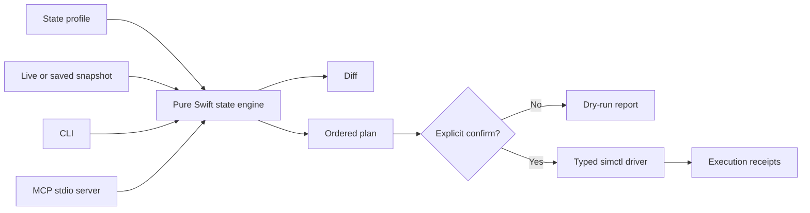

# awesome-ios-sim

[简体中文](README.zh-CN.md) · [MCP guide](docs/MCP.md) · [DeepSeek Harness](docs/DEEPSEEK_HARNESS.md) · [Signed distribution](docs/DISTRIBUTION.md) · [Architecture](docs/ARCHITECTURE.md)

[](https://github.com/qubyyang/awesome-ios-sim/actions/workflows/ci.yml)
[](LICENSE)
[](https://www.swift.org)

Simulator State as Code for iOS developers, CI pipelines, and AI agents.

`awesome-ios-sim` turns an iOS Simulator setup into a versioned profile that can be captured, diffed,
planned, reviewed, and safely applied. It provides both a deterministic CLI and an MCP stdio server.
It is also installable as a `dsh-plugin` bundle for DeepSeek Harness.

> **Project status: alpha.** The state schema is `v1alpha1`. Review generated plans before applying
> them, especially plans containing `erase` or app removal operations.

## Why this exists

Simulator automation is usually spread across shell scripts, undocumented defaults, and manual setup.
That makes test environments difficult to reproduce and gives AI agents an unsafe, untyped shell surface.

This project introduces one workflow:

```text
profile + current snapshot -> diff -> deterministic plan -> explicit confirmation -> audited apply
```

- **Declarative:** commit simulator profiles next to tests and application code.
- **Reviewable:** inspect the exact ordered operation plan before mutation.
- **Agent-safe:** MCP tools use JSON Schema and `simulator_apply` defaults to dry-run.
- **Capability-aware:** exact, best-effort, and unsupported state are reported explicitly.
- **Public API only:** mutations go through Apple's `xcrun simctl`; no private CoreSimulator frameworks.
- **Local-first:** no daemon, cloud account, telemetry, or API key.

## Architecture



The state engine has no Xcode dependency and is tested with fixtures. Only `SimctlDriver` touches the
host process boundary. The CLI and MCP server share the same planner, validation, and apply gates.

## Requirements

- macOS 13 or later.
- Swift 6.
- Full Xcode with an iOS Simulator runtime for live inventory, snapshot, or apply operations.
- `xcode-select` configured to the intended Xcode installation.

Command Line Tools alone can build the package, but they do not provide CoreSimulator or `simctl`.

## Install

```bash
git clone https://github.com/qubyyang/awesome-ios-sim.git
cd awesome-ios-sim
swift build -c release
```

The executables are produced at:

```text
.build/release/ios-sim-state
.build/release/ios-sim-state-mcp
```

Checksummed native archives for Apple Silicon and Intel macOS are published on the
[Releases page](https://github.com/qubyyang/awesome-ios-sim/releases). These initial archives are not yet
code-signed or notarized. Install the current release through this repository's explicit Homebrew tap:

```bash
brew tap qubyyang/awesome-ios-sim https://github.com/qubyyang/awesome-ios-sim
brew install qubyyang/awesome-ios-sim/awesome-ios-sim
```

On a prerelease macOS version that Homebrew has not identified yet, an internal `packages.*_dunno` API error can
be bypassed with Homebrew's source-tap mode:

```bash
HOMEBREW_NO_INSTALL_FROM_API=1 \
  brew install qubyyang/awesome-ios-sim/awesome-ios-sim
```

The next tagged distribution is gated on Developer ID signing and Apple notarization and will use one universal
archive on both architectures. See the [signed distribution guide](docs/DISTRIBUTION.md) for the trust model.

## Quick start

List available simulators:

```bash
swift run ios-sim-state inventory
```

Capture one simulator:

```bash
swift run ios-sim-state snapshot --device <UDID> > simulator.snapshot.json
```

Compose a target profile from reusable state before planning:

```bash
swift run ios-sim-state compose \
  --profile Examples/ui-tests.profile.json \
  --preset clean-status-bar \
  --layer Examples/ui-tests.layer.json > simulator.composed.json
```

Generate an offline plan from the included example:

```bash
swift run ios-sim-state plan \
  --profile Examples/ui-tests.profile.json \
  --snapshot Examples/ui-tests.snapshot.json > simulator.plan.json
```

Preview apply behavior without mutation (the default):

```bash
swift run ios-sim-state apply --plan simulator.plan.json
```

Apply a reviewed plan and retain an execution journal:

```bash
swift run ios-sim-state apply \
  --plan simulator.plan.json \
  --confirm \
  --journal simulator.report.json
```

`apply` stops at the first failing operation. Each receipt contains the executed argument arrays, exit
code, stdout, stderr, and timestamps.

## State profile

Profiles are JSON documents validated against
[`schemas/v1alpha1/simulator-state.schema.json`](schemas/v1alpha1/simulator-state.schema.json).
Fields with safe defaults may be omitted.

```json
{
  "apiVersion": "awesome-ios-sim/v1alpha1",
  "kind": "SimulatorState",
  "metadata": { "name": "ui-tests" },
  "target": {
    "name": "iPhone 17 Pro",
    "runtime": "com.apple.CoreSimulator.SimRuntime.iOS-27-0"
  },
  "spec": {
    "power": "shutdown",
    "applications": [
      {
        "bundleIdentifier": "com.example.app",
        "sourcePath": "/absolute/path/to/Example.app",
        "running": true,
        "launchArguments": ["--uitesting"]
      }
    ],
    "preferences": [
      {
        "domain": "com.example.app",
        "key": "hasSeenOnboarding",
        "value": false
      }
    ],
    "statusBar": { "time": "09:41", "batteryLevel": 100 }
  }
}
```

`power: "unchanged"` restores the original power state after temporary work. When an erase is planned,
a booted device is shut down first. Boot operations wait for `simctl bootstatus -b` before dependent work.
Profile decoding is strict: unknown fields and empty identifiers are rejected. `statusBar` accepts only the
public `simctl status_bar` overrides and validates enum values and numeric ranges before planning.

### Reusable layers and presets

A [`SimulatorStateLayer`](schemas/v1alpha1/simulator-state-layer.schema.json) contains only reusable `spec`
fields and deliberately has no `target`. Apply `--layer <file>` and `--preset <name>` to `compose`, `diff`, or
`plan`; repeat and interleave these options in the exact order they should be merged. The base profile keeps
its metadata and target.

Merge behavior is deterministic: later scalar values win; applications replace earlier entries with the same
`bundleIdentifier`; preferences replace the same `domain` + `key`; status-bar fields merge by key. Application
and preference arrays are sorted in the composed output. Absence means “no opinion”; use an application with
`presence: "absent"` when an uninstall is intended. There is no general delete/tombstone operator in
`v1alpha1`.

Built-in presets are `booted`, `clean-status-bar`, and `shutdown`. Run `ios-sim-state presets` to discover
their descriptions. [`Examples/ui-tests.layer.json`](Examples/ui-tests.layer.json) is a complete layer example.

## CLI

| Command | Mutation | Purpose |
| --- | --- | --- |
| `inventory` | No | List runtimes and simulators as stable JSON. |
| `snapshot --device <UDID>` | No | Capture managed state and capability metadata. |
| `presets` | No | List built-in reusable presets. |
| `compose --profile <file> [overlays]` | No | Materialize a complete profile from ordered layers and presets. |
| `diff --profile <file> [overlays] [--snapshot <file>]` | No | Show desired/current differences. |
| `plan --profile <file> [overlays] [--snapshot <file> \| --device <UDID>]` | No | Produce an ordered operation plan. |
| `apply --plan <file>` | No | Return a dry-run report. |
| `apply --plan <file> --confirm` | Yes | Execute the reviewed plan serially. |

All machine-facing output is JSON. Use `--compact` for one-line output.

## MCP for AI agents

Build the MCP executable and point any stdio-capable MCP client at its absolute path:

```json
{
  "mcpServers": {
    "awesome-ios-sim": {
      "command": "/absolute/path/awesome-ios-sim/.build/release/ios-sim-state-mcp"
    }
  }
}
```

The server exposes seven tools:

| Tool | Behavior |
| --- | --- |
| `simulator_inventory` | Read simulator inventory. |
| `simulator_snapshot` | Capture one simulator. |
| `simulator_presets` | List built-in reusable presets. |
| `simulator_compose` | Materialize a complete profile from ordered overlays. |
| `simulator_diff` | Compare a profile with saved or live state. |
| `simulator_plan` | Generate a typed, ordered plan. |
| `simulator_apply` | Dry-run by default; mutates only with `confirm: true`. |

The stdio server implements the MCP `2026-07-28` stateless request model, including
`server/discover`, per-request `_meta`, cacheable tool lists, `resultType`, and JSON Schema 2020-12.
It also accepts the legacy initialize handshake used by `2025-11-25`, `2025-06-18`, and `2024-11-05`
tool clients. See the [MCP guide](docs/MCP.md) for wire examples and the exact supported subset.

## DeepSeek Harness plugin

Install the repository as a DSH bundle and start the Web profile:

```bash
dsh plugin --profile web add github:qubyyang/awesome-ios-sim
dsh web
```

Harness bridges the existing MCP server and exposes namespaced tools such as
`mcp__ios_sim__simulator_inventory` and `mcp__ios_sim__simulator_plan`. The adapter is currently tested
against `@deepseek-ai/dsh` `0.1.0-rc.7`. Pin a tag or commit in reproducible environments because Harness
is still in developer preview.

See the [DeepSeek Harness guide](docs/DEEPSEEK_HARNESS.md) for configuration, development, tool names,
uninstall steps, and the host-process security boundary.

## State coverage

| State | Read | Write | Support |
| --- | --- | --- | --- |
| Power | Yes | Yes | Exact |
| Installed apps | Yes when `listapps` is available | Yes | Best effort |
| App running state | Not completely exposed by `simctl` | Launch/terminate | Best effort |
| Managed preference keys | No general readback | Scalar values and scalar arrays | Best effort |
| Status bar overrides | No complete readback | Yes, runtime-dependent | Best effort |
| Erase | N/A | Yes, explicit destructive operation | Exact mutation |

The planner never silently upgrades best-effort data to exact state. Missing readback produces capability
metadata, repeated idempotent writes, or a warning rather than a false claim of convergence.

## Safety model

- No shell is invoked; executable and arguments are passed separately.
- `diff`, `plan`, and default `apply` cannot mutate a simulator.
- CLI apply requires `--confirm`; MCP apply requires boolean `confirm: true`.
- Operations are serialized and stop on first failure.
- A booted simulator is shut down before erase.
- Temporary boots restore the requested or original final power state.
- Tool schemas disallow unknown top-level arguments.
- No private framework loading, orphan-directory deletion, or filesystem cleanup is performed.

Treat plan files as executable intent. Review changes to target UDIDs, app paths, erase operations, and
preference domains before confirmation.

## Why Swift

Simulator work is dominated by Xcode and CoreSimulator process latency, not language-level CPU time.
Swift provides native macOS distribution, strong `Codable` models, and direct alignment with iOS tooling
without adding a runtime. Rust would be a strong choice for a portable, CPU-heavy indexer, but it would
not materially accelerate `simctl boot`, install, or erase. The package keeps the pure state engine and
process boundary separate so a specialized helper can be introduced later if profiling justifies it.

## Development

```bash
swift build
swift test
npm ci
npm test
npm run pack:check
swift run ios-sim-state plan \
  --profile Examples/ui-tests.profile.json \
  --snapshot Examples/ui-tests.snapshot.json
```

Run the opt-in live suite against a real Xcode Simulator runtime:

```bash
DEVELOPER_DIR=/Applications/Xcode.app/Contents/Developer \
  Scripts/live-integration-test.sh
```

It creates and exclusively targets a uniquely named temporary simulator, verifies the CLI and MCP paths,
checks dry-run safety and confirmed reconciliation, then deletes that exact device. Existing simulators are
not selected or modified. The script requires `jq`; artifacts are retained under `.build/live-integration/`.

Build and inspect a versioned native release archive locally:

```bash
Scripts/release/verify-version.sh
Scripts/release/build-artifact.sh
```

GitHub automation can run an unpublished release candidate from the default branch. Tag-driven runs build
separate arm64 and x86_64 slices, merge and validate a universal archive, then require Developer ID signing,
Apple notarization, a checksum-bound Homebrew Formula, and GitHub provenance before publishing. See the
[compatibility contract](docs/COMPATIBILITY.md), [distribution contract](docs/DISTRIBUTION.md), and bilingual
[release process](docs/RELEASING.md). No release is created from an untagged branch build.

See [CONTRIBUTING.md](CONTRIBUTING.md), [SECURITY.md](SECURITY.md), and the
[architecture notes](docs/ARCHITECTURE.md). Please do not add private CoreSimulator APIs.

## Roadmap

- Expand capability-aware settings without private frameworks.
- Build a native SwiftUI companion app on top of the same state engine.
- Optionally enable Developer ID signing and notarization when protected release credentials are available.

## License

MIT. See [LICENSE](LICENSE).
