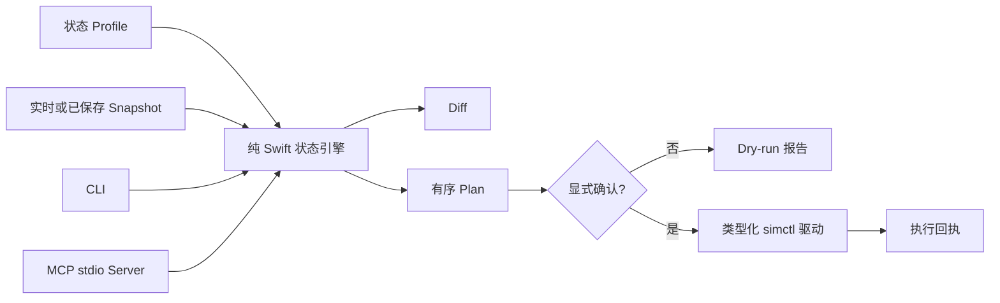

# awesome-ios-sim

[English](README.md) · [MCP 接入指南](docs/MCP.md) · [DeepSeek Harness](docs/DEEPSEEK_HARNESS.zh-CN.md) · [签名分发](docs/DISTRIBUTION.md) · [架构说明](docs/ARCHITECTURE.md)

[](https://github.com/qubyyang/awesome-ios-sim/actions/workflows/ci.yml)
[](LICENSE)
[](https://www.swift.org)

面向 iOS 开发者、CI 流水线和 AI Agent 的 Simulator State as Code 工具。

`awesome-ios-sim` 把 iOS 模拟器环境表达成可版本管理的 profile，并支持 snapshot、diff、plan、
人工审查和安全 apply。项目同时提供确定性的 CLI 与 MCP stdio Server。
本仓库也可以作为 `dsh-plugin` Bundle 安装到 DeepSeek Harness。

> **项目状态：Alpha。** 当前状态协议为 `v1alpha1`。执行前请审查生成的 plan，尤其是包含
> `erase` 或卸载应用的操作。

## 为什么需要它

模拟器自动化通常散落在 Shell 脚本、未记录的 defaults 命令和人工操作中。测试环境难以复现，
AI Agent 也只能面对缺少类型和安全边界的 Shell。

本项目把流程统一为：

```text
profile + 当前 snapshot -> diff -> 确定性 plan -> 显式确认 -> 带审计回执的 apply
```

- **声明式：** profile 可以和测试、业务代码一起提交。
- **可审查：** 修改前先看到完整、稳定排序的操作计划。
- **Agent 安全：** MCP 工具带 JSON Schema，`simulator_apply` 默认 dry-run。
- **能力透明：** 明确区分 exact、best-effort 和 unsupported 状态。
- **只用公开能力：** 所有修改均通过 Apple 的 `xcrun simctl`，不加载私有 CoreSimulator 框架。
- **本地优先：** 不需要守护进程、云账号、遥测或 API Key。

## 架构



状态引擎不依赖 Xcode，可以使用 fixture 测试；只有 `SimctlDriver` 会跨越宿主进程边界。CLI 和
MCP Server 复用同一套 planner、校验和 apply 门禁，不存在绕过安全模型的 Agent 快捷通道。

## 环境要求

- macOS 13 或更高版本。
- Swift 6。
- 执行实时 inventory、snapshot 或 apply 时，需要完整 Xcode 和 iOS Simulator Runtime。
- `xcode-select` 已指向需要使用的 Xcode。

仅安装 Command Line Tools 可以构建 Swift Package，但其中不包含 CoreSimulator 与 `simctl`。

## 安装

```bash
git clone https://github.com/qubyyang/awesome-ios-sim.git
cd awesome-ios-sim
swift build -c release
```

可执行文件位于：

```text
.build/release/ios-sim-state
.build/release/ios-sim-state-mcp
```

[Releases 页面](https://github.com/qubyyang/awesome-ios-sim/releases)会提供 Apple Silicon 与 Intel macOS
的原生压缩包及校验和。首批压缩包尚未进行代码签名和公证，可以通过本仓库的显式 Homebrew Tap 安装：

```bash
brew tap qubyyang/awesome-ios-sim https://github.com/qubyyang/awesome-ios-sim
brew install qubyyang/awesome-ios-sim/awesome-ios-sim
```

如果使用 Homebrew 尚未识别的 macOS 预发布版本，并遇到内部 `packages.*_dunno` API 错误，可以切换到
Homebrew 的源码 Tap 模式：

```bash
HOMEBREW_NO_INSTALL_FROM_API=1 \
  brew install qubyyang/awesome-ios-sim/awesome-ios-sim
```

下一个带 Tag 的分发版本会强制经过 Developer ID 签名与 Apple 公证，并在两种架构上使用同一份
Universal 压缩包。完整信任模型见[签名分发指南](docs/DISTRIBUTION.md)。

## 快速开始

列出模拟器：

```bash
swift run ios-sim-state inventory
```

采集指定模拟器：

```bash
swift run ios-sim-state snapshot --device <UDID> > simulator.snapshot.json
```

使用仓库内的示例离线生成 plan：

```bash
swift run ios-sim-state plan \
  --profile Examples/ui-tests.profile.json \
  --snapshot Examples/ui-tests.snapshot.json > simulator.plan.json
```

预览 apply，不产生修改（默认行为）：

```bash
swift run ios-sim-state apply --plan simulator.plan.json
```

执行已审查的 plan，并保留执行日志：

```bash
swift run ios-sim-state apply \
  --plan simulator.plan.json \
  --confirm \
  --journal simulator.report.json
```

`apply` 在第一条失败操作处停止。每条回执包含实际参数数组、退出码、stdout、stderr 和时间戳。

## 状态 Profile

Profile 是经过 [`schemas/v1alpha1/simulator-state.schema.json`](schemas/v1alpha1/simulator-state.schema.json)
校验的 JSON 文档。带安全默认值的字段可以省略。

```json
{
  "apiVersion": "awesome-ios-sim/v1alpha1",
  "kind": "SimulatorState",
  "metadata": { "name": "ui-tests" },
  "target": {
    "name": "iPhone 17 Pro",
    "runtime": "com.apple.CoreSimulator.SimRuntime.iOS-27-0"
  },
  "spec": {
    "power": "shutdown",
    "applications": [
      {
        "bundleIdentifier": "com.example.app",
        "sourcePath": "/absolute/path/to/Example.app",
        "running": true,
        "launchArguments": ["--uitesting"]
      }
    ],
    "preferences": [
      {
        "domain": "com.example.app",
        "key": "hasSeenOnboarding",
        "value": false
      }
    ],
    "statusBar": { "time": "09:41", "batteryLevel": 100 }
  }
}
```

`power: "unchanged"` 会在临时操作结束后恢复原始电源状态。需要 erase 时，会先关闭已启动设备；
boot 后会等待 `simctl bootstatus -b` 完成，再执行依赖操作。
Profile 使用严格解码：未知字段与空标识符会被拒绝。`statusBar` 只接受公开的 `simctl status_bar`
覆盖项，并会在生成 Plan 前检查枚举值和数值范围。

## CLI

| 命令 | 是否修改 | 用途 |
| --- | --- | --- |
| `inventory` | 否 | 以稳定 JSON 列出 Runtime 和模拟器。 |
| `snapshot --device <UDID>` | 否 | 采集托管状态与能力元数据。 |
| `diff --profile <file> [--snapshot <file>]` | 否 | 显示期望状态和当前状态的差异。 |
| `plan --profile <file> [--snapshot <file> \| --device <UDID>]` | 否 | 生成有序操作计划。 |
| `apply --plan <file>` | 否 | 返回 dry-run 报告。 |
| `apply --plan <file> --confirm` | 是 | 串行执行已审查的 plan。 |

所有面向机器的输出都是 JSON；使用 `--compact` 可输出单行 JSON。

## MCP 与 AI Agent

构建 MCP 可执行文件，并在支持 stdio 的 MCP Client 中配置绝对路径：

```json
{
  "mcpServers": {
    "awesome-ios-sim": {
      "command": "/absolute/path/awesome-ios-sim/.build/release/ios-sim-state-mcp"
    }
  }
}
```

Server 提供 5 个工具：

| 工具 | 行为 |
| --- | --- |
| `simulator_inventory` | 读取模拟器清单。 |
| `simulator_snapshot` | 采集单个模拟器。 |
| `simulator_diff` | 比较 profile 与实时或已保存状态。 |
| `simulator_plan` | 生成类型化、有序 plan。 |
| `simulator_apply` | 默认 dry-run；只有 `confirm: true` 才会修改。 |

stdio Server 支持 MCP `2026-07-28` 无状态请求模型，包括 `server/discover`、逐请求 `_meta`、
可缓存工具列表、`resultType` 和 JSON Schema 2020-12。同时兼容 `2025-11-25`、`2025-06-18`
和 `2024-11-05` 工具客户端的旧初始化握手。精确支持范围和线级示例见 [MCP 指南](docs/MCP.md)。

## DeepSeek Harness 插件

把本仓库作为 DSH Bundle 安装，并启动 Web Profile：

```bash
dsh plugin --profile web add github:qubyyang/awesome-ios-sim
dsh web
```

Harness 会桥接现有 MCP Server，并公开 `mcp__ios_sim__simulator_inventory`、
`mcp__ios_sim__simulator_plan` 等带 Namespace 的工具。当前兼容基线为 `@deepseek-ai/dsh`
`0.1.0-rc.7`。由于 Harness 仍处于 Developer Preview，可复现环境应固定 Tag 或 Commit。

完整配置、开发流程、工具名、卸载方式和宿主进程安全边界见
[DeepSeek Harness 指南](docs/DEEPSEEK_HARNESS.zh-CN.md)。

## 状态覆盖范围

| 状态 | 读取 | 写入 | 支持级别 |
| --- | --- | --- | --- |
| 电源 | 是 | 是 | Exact |
| 已安装应用 | `listapps` 可用时可读 | 是 | Best effort |
| 应用运行状态 | `simctl` 不提供完整读取 | Launch/terminate | Best effort |
| 托管 Preference Key | 无通用回读 | 标量与标量数组 | Best effort |
| 状态栏覆盖 | 无完整回读 | 是，取决于 Runtime | Best effort |
| Erase | 不适用 | 是，显式破坏性操作 | Exact mutation |

Planner 不会把 best-effort 数据伪装成精确状态。无法回读时，会返回 capability 元数据、执行可
重复的幂等写入或给出 warning，而不是错误宣称已经收敛。

## 安全模型

- 不调用 Shell；可执行文件与参数始终分开传递。
- `diff`、`plan` 和默认 `apply` 都不能修改模拟器。
- CLI apply 需要 `--confirm`；MCP apply 需要布尔值 `confirm: true`。
- 操作串行执行，并在第一条失败操作处停止。
- erase 前会关闭已启动的模拟器。
- 临时 boot 结束后恢复 profile 指定或原始电源状态。
- MCP Schema 禁止未知顶层参数。
- 不加载私有框架，不删除孤立目录，也不做文件系统清理。

Plan 文件等同于“可执行意图”。确认前请重点审查目标 UDID、App 路径、erase 操作和 Preference Domain。

## 为什么选择 Swift

模拟器操作的主要耗时来自 Xcode 和 CoreSimulator 进程，而不是语言层 CPU。Swift 可以原生分发
macOS 工具，提供强类型 `Codable` 模型，并与 iOS 工具链保持一致，不需要额外 Runtime。Rust 很
适合跨平台、CPU 密集型索引器，但不会明显加速 `simctl boot`、install 或 erase。项目已经把纯状态
引擎与进程边界分离；未来只有性能数据证明必要时，才会引入专用 Helper。

## 开发

```bash
swift build
swift test
npm ci
npm test
npm run pack:check
swift run ios-sim-state plan \
  --profile Examples/ui-tests.profile.json \
  --snapshot Examples/ui-tests.snapshot.json
```

在真实 Xcode Simulator Runtime 上运行 opt-in live 测试：

```bash
DEVELOPER_DIR=/Applications/Xcode.app/Contents/Developer \
  Scripts/live-integration-test.sh
```

脚本会创建并只操作一个名称唯一的临时模拟器，验证 CLI 与 MCP 链路、dry-run 安全边界和确认后的
状态收敛，最后精确删除该设备，不会选择或修改已有模拟器。脚本依赖 `jq`，测试产物保留在
`.build/live-integration/` 下。

在本地构建并检查带版本的原生 Release 压缩包：

```bash
Scripts/release/verify-version.sh
Scripts/release/build-artifact.sh
```

GitHub 自动化可以从默认分支运行不公开发布的 Release Candidate。Tag 驱动的运行会分别构建 arm64 与
x86_64 Slice，合并并验证 Universal 压缩包，然后强制执行 Developer ID 签名、Apple 公证、绑定
校验和的 Homebrew Formula 和 GitHub 来源证明。详见[兼容性契约](docs/COMPATIBILITY.md)、
[分发契约](docs/DISTRIBUTION.md)和双语[发布流程](docs/RELEASING.md)。未打 Tag 的分支构建不会创建 Release。

请阅读 [CONTRIBUTING.md](CONTRIBUTING.md)、[SECURITY.md](SECURITY.md) 和
[架构说明](docs/ARCHITECTURE.md)。项目不接受私有 CoreSimulator API。

## 路线图

- 配置受保护的 Developer ID 与 App Store Connect 发布凭据。
- 支持可复用的 Profile Layer 和 Preset。
- 在不依赖私有框架的前提下扩展能力感知设置。
- 基于同一状态引擎构建原生 SwiftUI 配套应用。

## 许可证

MIT，见 [LICENSE](LICENSE)。
